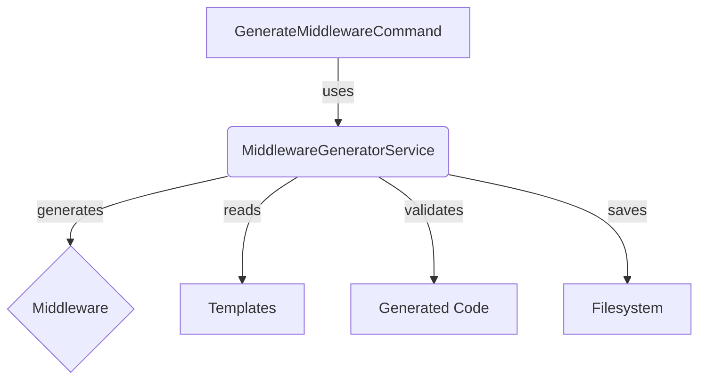
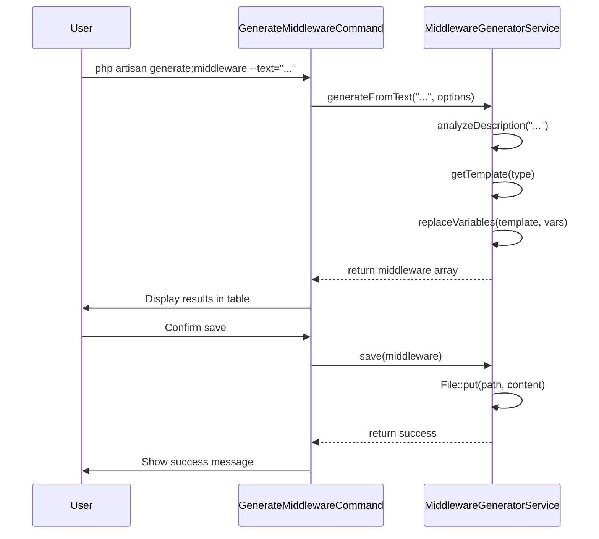

# 🛡️ Middleware Generator v3.28.0 - وثيقة التصميم

**التاريخ:** 2025-12-03  
**الإصدار:** 3.28.0  
**المؤلف:** Manus AI  
**المشروع:** php-magic-system (SEMOP)

---

## 1. 🎯 الأهداف والمتطلبات

### 1.1. الهدف الأساسي

بناء مولد Middleware ذكي ومتقدم لـ Laravel يهدف إلى تسريع عملية التطوير، توحيد معايير الكود، وتعزيز جودة وأمان التطبيقات. يجب أن يكون المولد قادراً على توليد أنواع مختلفة من Middleware من خلال واجهة سطر أوامر (CLI) تفاعلية وسهلة الاستخدام.

### 1.2. المتطلبات الوظيفية

1.  **دعم أنواع متعددة:** يجب أن يدعم المولد توليد 10 أنواع أساسية من Middleware:
    *   Authentication
    *   Permission/Authorization
    *   Rate Limiting
    *   Request Logging
    *   CORS
    *   Request Validation
    *   Response Cache
    *   Request/Response Transformation
    *   Security Headers
    *   Custom (قالب مفتوح)

2.  **مصادر توليد متعددة:** يجب أن يدعم المولد التوليد من المصادر التالية:
    *   **وصف نصي:** تحليل اللغة الطبيعية لتوليد Middleware مناسب.
    *   **JSON Schema:** توليد Middleware بناءً على تعريفات JSON.
    *   **قوالب مخصصة:** استخدام قوالب Blade لتوليد Middleware قابل لإعادة الاستخدام.

3.  **واجهة سطر أوامر (CLI):** يجب توفير أمر Artisan (`generate:middleware`) مع الميزات التالية:
    *   واجهة تفاعلية (Interactive Menu) للاستخدام السهل.
    *   خيارات (Options) للتحكم الكامل من سطر الأوامر.
    *   عرض قائمة بالأنواع المدعومة.
    *   توليد أسماء تلقائية ذكية.

4.  **التحقق من الصحة (Validation):** يجب أن يتضمن المولد آلية للتحقق من صحة الكود المولد:
    *   التحقق من PHP Syntax.
    *   التحقق من وجود `handle` method.
    *   التحقق من المتطلبات الأساسية للكلاس.

5.  **الحفظ والنشر:** يجب أن يوفر المولد خياراً لحفظ الملف المولد تلقائياً في المسار الصحيح (`app/Http/Middleware`).

### 1.3. المتطلبات غير الوظيفية

1.  **الأداء:** يجب أن تكون عملية التوليد سريعة (< 100ms).
2.  **الجودة:** يجب أن يكون الكود المولد نظيفاً، موثقاً، ويتبع معايير PSR-12.
3.  **قابلية التوسع:** يجب أن يكون من السهل إضافة أنواع وقوالب جديدة في المستقبل.
4.  **الأمان:** يجب أن يكون المولد آمناً ضد ثغرات مثل Path Traversal.
5.  **التوثيق:** يجب توفير توثيق شامل للمولد مع أمثلة عملية.

---

## 2. 🏛️ المعمارية والتصميم

### 2.1. المكونات الرئيسية

يتكون المولد من مكونين رئيسيين:

1.  **`MiddlewareGeneratorService`:** الخدمة الأساسية التي تحتوي على منطق التوليد، التحليل، والتحقق.
2.  **`GenerateMiddlewareCommand`:** أمر Artisan الذي يوفر واجهة CLI للمستخدم للتفاعل مع الخدمة.



### 2.2. تصميم `MiddlewareGeneratorService`

هذه الخدمة هي قلب المولد وتحتوي على المنطق الأساسي. تم تصميمها لتكون معيارية وقابلة للتوسع.

#### 2.2.1. الخصائص الرئيسية

| الخاصية | النوع | الوصف |
|---|---|---|
| `TYPES` | `const array` | قائمة بأنواع Middleware المدعومة وأوصافها. |
| `middlewarePath` | `string` | المسار الافتراضي لحفظ Middleware. |
| `templatesPath` | `string` | المسار الافتراضي لقوالب Middleware. |

#### 2.2.2. الوظائف الرئيسية

| الوظيفة | المدخلات | المخرجات | الوصف |
|---|---|---|---|
| `generateFromText` | `string`, `array` | `array` | توليد Middleware من وصف نصي. |
| `generateFromJson` | `array` | `array` | توليد Middleware من JSON Schema. |
| `generateFromTemplate` | `string`, `array` | `array` | توليد Middleware من قالب. |
| `generateContent` | `string`, `string`, `string`, `array` | `string` | توليد محتوى الكود باستخدام القوالب. |
| `getTemplate` | `string` | `string` | الحصول على القالب المناسب حسب النوع. |
| `validate` | `array` | `array` | التحقق من صحة الكود المولد. |
| `save` | `array` | `bool` | حفظ Middleware إلى ملف. |
| `analyzeDescription` | `string` | `array` | تحليل الوصف النصي لتحديد النوع. |
| `generateName` | `string` | `string` | توليد اسم ذكي للكلاس. |

### 2.3. تصميم `GenerateMiddlewareCommand`

هذا الأمر يوفر واجهة المستخدم للتفاعل مع المولد من خلال سطر الأوامر.

#### 2.3.1. الخصائص الرئيسية

| الخاصية | النوع | الوصف |
|---|---|---|
| `signature` | `string` | تعريف الأمر وخياراته. |
| `description` | `string` | وصف الأمر. |
| `generatorService` | `MiddlewareGeneratorService` | نسخة من خدمة التوليد. |

#### 2.3.2. الوظائف الرئيسية

| الوظيفة | الوصف |
|---|---|
| `handle` | النقطة الرئيسية لتنفيذ الأمر. |
| `showInteractiveMenu` | عرض القائمة التفاعلية. |
| `generateFromText` | معالجة التوليد من وصف نصي. |
| `generateFromJson` | معالجة التوليد من JSON. |
| `generateFromTemplate` | معالجة التوليد من قالب. |
| `displayMiddlewareResult` | عرض نتائج التوليد بشكل منظم. |
| `listTypes` | عرض قائمة بالأنواع المدعومة. |

### 2.4. نظام القوالب

يعتمد المولد على نظام قوالب مرن باستخدام PHP Heredoc Syntax. كل نوع من Middleware له قالب خاص به.

*   **الموقع:** `app/Templates/Middleware/`
*   **المتغيرات:** يتم استخدام متغيرات مثل `{{name}}`, `{{namespace}}`, `{{description}}` ليتم استبدالها بالقيم المناسبة.
*   **التوسع:** يمكن إضافة قوالب جديدة بسهولة عن طريق إنشاء ملفات PHP جديدة في مجلد القوالب.

---

## 3. ⚙️ آلية العمل (Workflow)

1.  **استدعاء الأمر:** يقوم المستخدم باستدعاء الأمر `php artisan generate:middleware` مع الخيارات المناسبة.
2.  **تحديد المصدر:** يحدد الأمر مصدر التوليد (نص، JSON، قالب) أو يعرض القائمة التفاعلية.
3.  **جمع المعلومات:** يجمع الأمر المعلومات المطلوبة من المستخدم (الوصف، الاسم، النوع، ...).
4.  **استدعاء الخدمة:** يستدعي الأمر الوظيفة المناسبة في `MiddlewareGeneratorService`.
5.  **تحليل وتوليد:** تقوم الخدمة بتحليل المدخلات، تحديد النوع، واختيار القالب المناسب.
6.  **استبدال المتغيرات:** يتم استبدال المتغيرات في القالب بالقيم الفعلية.
7.  **إرجاع النتيجة:** تعيد الخدمة مصفوفة تحتوي على تفاصيل Middleware المولد (الاسم، المحتوى، المسار، ...).
8.  **عرض النتائج:** يقوم الأمر بعرض النتائج بشكل منظم في جدول.
9.  **التحقق والحفظ (اختياري):** إذا طلب المستخدم، يتم التحقق من صحة الكود وحفظه في نظام الملفات.



---

## 4. 📂 بنية الملفات

```
php-magic-system/
├── app/
│   ├── Console/
│   │   └── Commands/
│   │       └── GenerateMiddlewareCommand.php  # أمر Artisan
│   ├── Http/
│   │   └── Middleware/                      # مجلد Middleware المولد
│   ├── Services/
│   │   └── MiddlewareGeneratorService.php   # خدمة التوليد
│   └── Templates/
│       └── Middleware/                      # مجلد القوالب
│           ├── README.md
│           ├── api-versioning.php
│           └── example-schema.json
├── tests/
│   └── MiddlewareGeneratorTest.php          # أداة الاختبار
├── MIDDLEWARE_GENERATOR_DESIGN.md         # هذه الوثيقة
├── MIDDLEWARE_GENERATOR_EXAMPLES.md       # أمثلة الاستخدام
└── MIDDLEWARE_GENERATOR_TEST_REPORT.md    # تقرير الاختبار
```

---

## 5. 🔮 التحسينات المستقبلية

1.  **دعم AI:** استخدام نماذج اللغة الكبيرة (LLMs) لتوليد منطق Middleware أكثر تعقيداً من وصف نصي.
2.  **توليد اختبارات تلقائية:** توليد ملفات Unit/Feature Tests تلقائياً للـ Middleware المولد.
3.  **واجهة ويب (GUI):** إنشاء واجهة ويب لتسهيل عملية التوليد للمستخدمين غير التقنيين.
4.  **تكامل مع IDEs:** إنشاء إضافات لـ VS Code أو PhpStorm لتوليد Middleware مباشرة من المحرر.
5.  **دعم لغات أخرى:** توسيع المولد لدعم أطر عمل أخرى مثل Symfony أو Node.js (Express).

---

## 6. 🎯 الخلاصة

يوفر تصميم Middleware Generator v3.28.0 حلاً قوياً ومرناً لتوليد Middleware في Laravel. من خلال فصل المنطق في خدمة مخصصة واستخدام نظام قوالب قابل للتوسع، يضمن التصميم سهولة الصيانة وإضافة الميزات في المستقبل. الواجهة التفاعلية والخيارات المتقدمة تجعل المولد أداة لا غنى عنها لأي مطور Laravel يسعى لتحسين إنتاجيته وجودة الكود.

---

**Generated by Manus AI**  
**SEMOP Team © 2025**
